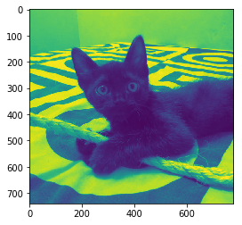

# Sistema de comunicación Basado en FPGA


El proceso para enviar información con el sistema presentado se puede definir en los siguientes pasos:
* Asegurarse que el interruptor $0$ (enb-*enable*) esta activado, pues así, el sistema estará en funcionamiento.
* Establecer la frecuencia de comunicación entre los módulos, para esto se usa el comando **cb.OUT_REGS.setValue(reg_setFreq$, i$)**, donde: $i = 1 \rightarrow 1Hz; 2 \rightarrow 10Hz; 3 \rightarrow 100Hz; 3 \rightarrow 500Hz; 5 \rightarrow 1kHz; 6\rightarrow 5kHz$ 
* Establecer el mensaje a enviar, en esta versión se puede enviar de a $8$ bits a la vez. Esto se hace con el comando **cb.OUT_REGS.setValue(reg_message_toSend, mensaje)**, el mensaje debe tener formato byte o int.
* Activar la transmisión, para esto se pone en alto la señal *send* con el comando **cb.OUT_REGS.setValue(reg_send, 1)**.
* Esperar hasta que el dato sea enviado y recibido para poder enviar el siguiente, para ello, antes de enviar otro dato, se chequea el estatus del proceso, si el valor de **cb.IN_REGS.getValue(reg_status)** es $3$, es porque el proceso, tanto de envió como de recepción, culminó, en caso contrarió, será $0$ o $1$ si no se ha termino ninguno de los dos o si se termino solo la transmisión respectivamente. Cuando se termine el envío, es decir, cuando el estatus es $1$, se debe poner en bajo la señal *send* para que no se repita el indefinidamente.
* El dato leído se ira almacenando en una memoria **FIFO** y en el **registro $1$** de entrada, de forma que luego pueden leerse un conjunto de datos que fueron enviados (máximo 1024) o ir leyendo de uno por uno en el registro mencionado. 


Todo el proceso mencionado ya ha sido condensado en un par de funciones. Para enviar un mensaje extenso (máximo 1024 bytes) se utiliza la función **transmit(mensaje, 'frecuencia')**, el mensaje debe estar como arreglo de bytes o int. esta función retorna el tiempo que le toma al sistema enviar y recibir el mensaje. Para recolectar lo que fue enviado se lee la memoria FIFO, para ello se usa la función **receive()**.


## Esquema real del sistema de comunicación


```python
from pynq.overlays.comunication_with_comblock import * # se importan las funciones transmite y receive, 
                                                       # asi como las variables globales necesarias.
from numpy import loadtxt
```


```python
# si el mensaje que se desea enviar esta en un archivo.
texto1 = []
with open("texto.txt", 'r') as file:
    for i in file:
        texto1.append(i)
texto1
```


    ['Lorem ipsum dolor sit amet consectetur adipiscing elit montes, euismod id rhoncus tincidunt sapien morbi leo cursus sollicitudin, aliquam cum neque lectus praesent sagittis in. Urna ultricies sapien odio curabitur cursus sed sollicitudin ac sociis pellentesque, conubia luctus eget rutrum magnis erat fames enim senectus, nostra sociosqu consequat phasellus et iaculis ornare hendrerit bibendum. Justo suscipit magnis dapibus class ad urna, aptent eros iaculis eleifend tortor, et vulputate imperdiet dis primis. Parturient aptent fames ullamcorper etiam hendrerit bibendum proin id, ac placerat nisi porta hac quis augue, faucibus auctor semper in rhoncus litora malesuada. Mattis potenti sociosqu integer commodo hendrerit montes sed augue sapien sem sodales eget, litora turpis risus diam porta convallis ac parturient interdum phasellus praesent orci, tincidunt varius torquent porttitor aliquam dapibus vulputate primis morbi ut felis. Velit non facilisi eleifend lectus enim auctor, cras at gravida senectus vel habit.']


```python
#tambien se puede definir a mano
texto2 = ['Mucho se ha dicho respecto al alcance de la fisica cuantica en los tiempos contemporaneos. Desde los revolucionarios aportes de Albert Einstein a mediados del siglo, hasta las recientes experiencias con fotones y la aceleracion de particulas, nuestro entendimiento del universo ha variado tanto, en sentidos tan impredecibles, que a nadie sorprendera lo intangible de la discusion teorica involucrada en este ensayo. La fisica cuantica, en su empeño por descoser los hilos de la madeja del universo, nos ha llevado a entender y aceptar que es imposible teorizar sin un importante margen de idealizacion o al menos de especulacion fundamentada. He alli que en este ensayo nos ocupemos del modo puntual en que dichas especulaciones operan, sobre todo a la hora de validar conocimientos especializados del area de la fisica y de la astronomiahoy.']
```


```python
# se hace el type casting de los mensajes
texto1 = bytes(texto1[0], 'utf8')
texto2 = bytes(texto2[0], 'utf8')
# mensaje mas corto de prueba
prueba = bytes("Esto es un mensaje de prueba, no muy largo pero servira para poner a prueba el sistema", 'utf8')

```


```python
receive()
```

    ...reading FIFO_in...
    ...End...


    ''


```python
transmit(prueba, '100hz') # se hace la prueba de envio a 1khz
```


    7.656419933000052


```python
receive()  #se revisa que fue lo que llego
```

    ...reading FIFO_in...
    ...End...


    ''


Ya entendidó como se manipula el sistema de comunicación, podemos ver si el sistema falla cuando se varía la frecuencia y la cantidad de información.


### Dependencia con la frecuancia


```python
t = []
messages = []
freqs = ['1hz', '10hz', '100hz', '500hz', '1khz', '10khz', '15khz', '20khz', '25khz', '50khz']

for i in freqs:
    t.append(transmit(prueba, i))
    messages.append(receive())
    
t, messages
```

    ...reading FIFO_in...
    ...End...
    ...reading FIFO_in...
    ...End...
    ...reading FIFO_in...
    ...End...
    ...reading FIFO_in...
    ...End...
    ...reading FIFO_in...
    ...End...
    ...reading FIFO_in...
    ...End...
    ...reading FIFO_in...
    ...End...
    ...reading FIFO_in...
    ...End...
    ...reading FIFO_in...
    ...End...
    ...reading FIFO_in...
    ...End...


    ([1029.58160153,
      102.97891930100013,
      10.270724369999698,
      2.062294514000314,
      1.029997340999671,
      0.1133449619997009,
      0.0836922409998806,
      0.06281846199999563,
      0.05377529599991249,
      0.035937206000198785],
     ['Esto es un mensaje de prueba, no muy largo pero servira para poner a prueba el sistema',
      'Esto es un mensaje de prueba, no muy largo pero servira para poner a prueba el sistema',
      'Esto es un mensaje de prueba, no muy largo pero servira para poner a prueba el sistema',
      'Esto es un mensaje de prueba, no muy largo pero servira para poner a prueba el sistema',
      'Esto es un mensaje de prueba, no muy largo pero servira para poner a prueba el sistema',
      'Esto es un mensaje de prueba, no muy largo pero servira para poner a prueba el sistema',
      'Esto es un mensaje de prueba, no muy largo pero servira para poner a prueba el sistema',
      'Esto es un mensaje de prueba, no muy largo pero servira para poner a prueba el sistema',
      'Esto es un mensaje de prueba, no muy largo pero servira para poner a prueba el sistema',
      'Esto es un mensaje de prueba, no muy largo pero servira para poner a prueba el sistema'])


### Dependencia con la cantidad de información


```python
i = 86
message_sended, message_received = [], []
while(i <= 857):
    message_sended.append(texto2[:i])
    transmit(texto2[:i], '1khz')
    message_received.append(receive()[:i])
    i+=86
    sleep(1)

```

    ...reading FIFO_in...
    ...End...
    ...reading FIFO_in...
    ...End...
    ...reading FIFO_in...
    ...End...
    ...reading FIFO_in...
    ...End...
    ...reading FIFO_in...
    ...End...
    ...reading FIFO_in...
    ...End...
    ...reading FIFO_in...
    ...End...
    ...reading FIFO_in...
    ...End...
    ...reading FIFO_in...
    ...End...


```python
message_received
```


    ['Mucho se ha dicho respecto al alcance de la fisica cuantica en los tiempos contemporan',
     'Mucho se ha dicho respecto al alcance de la fisica cuantica en los tiempos contemporaneos. Desde los revolucionarios aportes de Albert Einstein a mediados del siglo, hasta ',
     'Mucho se ha dicho respecto al alcance de la fisica cuantica en los tiempos contemporaneos. Desde los revolucionarios aportes de Albert Einstein a mediados del siglo, hasta las recientes experiencias con fotones y la aceleracion de particulas, nuestro entendi',
     'Mucho se ha dicho respecto al alcance de la fisica cuantica en los tiempos contemporaneos. Desde los revolucionarios aportes de Albert Einstein a mediados del siglo, hasta las recientes experiencias con fotones y la aceleracion de particulas, nuestro entendimiento del universo ha variado tanto, en sentidos tan impredecibles, que a nadie sorpr',
     'Mucho se ha dicho respecto al alcance de la fisica cuantica en los tiempos contemporaneos. Desde los revolucionarios aportes de Albert Einstein a mediados del siglo, hasta las recientes experiencias con fotones y la aceleracion de particulas, nuestro entendimiento del universo ha variado tanto, en sentidos tan impredecibles, que a nadie sorprendera lo intangible de la discusion teorica involucrada en este ensayo. La fisica cua',
     'Mucho se ha dicho respecto al alcance de la fisica cuantica en los tiempos contemporaneos. Desde los revolucionarios aportes de Albert Einstein a mediados del siglo, hasta las recientes experiencias con fotones y la aceleracion de particulas, nuestro entendimiento del universo ha variado tanto, en sentidos tan impredecibles, que a nadie sorprendera lo intangible de la discusion teorica involucrada en este ensayo. La fisica cuantica, en su empeño por descoser los hilos de la madeja del universo, nos ha llevado ',
     'Mucho se ha dicho respecto al alcance de la fisica cuantica en los tiempos contemporaneos. Desde los revolucionarios aportes de Albert Einstein a mediados del siglo, hasta las recientes experiencias con fotones y la aceleracion de particulas, nuestro entendimiento del universo ha variado tanto, en sentidos tan impredecibles, que a nadie sorprendera lo intangible de la discusion teorica involucrada en este ensayo. La fisica cuantica, en su empeño por descoser los hilos de la madeja del universo, nos ha llevado a entender y aceptar que es imposible teorizar sin un importante margen de idealizacio',
     'Mucho se ha dicho respecto al alcance de la fisica cuantica en los tiempos contemporaneos. Desde los revolucionarios aportes de Albert Einstein a mediados del siglo, hasta las recientes experiencias con fotones y la aceleracion de particulas, nuestro entendimiento del universo ha variado tanto, en sentidos tan impredecibles, que a nadie sorprendera lo intangible de la discusion teorica involucrada en este ensayo. La fisica cuantica, en su empeño por descoser los hilos de la madeja del universo, nos ha llevado a entender y aceptar que es imposible teorizar sin un importante margen de idealizacion o al menos de especulacion fundamentada. He alli que en este ensayo nos ocupemos del',
     'Mucho se ha dicho respecto al alcance de la fisica cuantica en los tiempos contemporaneos. Desde los revolucionarios aportes de Albert Einstein a mediados del siglo, hasta las recientes experiencias con fotones y la aceleracion de particulas, nuestro entendimiento del universo ha variado tanto, en sentidos tan impredecibles, que a nadie sorprendera lo intangible de la discusion teorica involucrada en este ensayo. La fisica cuantica, en su empeño por descoser los hilos de la madeja del universo, nos ha llevado a entender y aceptar que es imposible teorizar sin un importante margen de idealizacion o al menos de especulacion fundamentada. He alli que en este ensayo nos ocupemos del modo puntual en que dichas especulaciones operan, sobre todo a la hora de validar con']


Podemos notar, que la transmición de la información se da con exito en cada caso y sin perdida de información.

## Trasminitir una Imagen


```python
import matplotlib.pyplot as plt
import matplotlib.image as mpimg
```


```python
img = mpimg.imread('bagheera.jpg')
im = img[100:-200,:,0]
```


```python
plt.imshow(im)
```


    <matplotlib.image.AxesImage at 0xaed00430>


```python
im.shape
im = im.tobytes()
len(im)
```


    577200


```python
im_recv=[]
for i in range(0, len(im), 780):
    transmit(im[i:i + 780], '5khz')
    im_recv.append(receive("array")[:780])
    sleep(0.5)
```

    ...reading FIFO_in...
    ...End...
    ...reading FIFO_in...
    ...End...
    ...reading FIFO_in...
    ...End...
    ...reading FIFO_in...
    ...End...
    ...reading FIFO_in...
    ...End...
    ...reading FIFO_in...
    ...End...
    ...reading FIFO_in...
    ...End...
    ...reading FIFO_in...
    ...End...
    ...reading FIFO_in...
    ...End...
    ...reading FIFO_in...
    ...End...
    ...reading FIFO_in...
    ...End...
    ...reading FIFO_in...
    ...End...
    ...reading FIFO_in...
    ...End...
    ...reading FIFO_in...
    ...End...
    ...reading FIFO_in...
    ...End...
    ...reading FIFO_in...
    ...End...
    ...reading FIFO_in...
    ...End...
    ...reading FIFO_in...
    ...End...
    ...reading FIFO_in...
    ...End...
    ...reading FIFO_in...
    ...End...
    ...reading FIFO_in...
    ...End...
    ...reading FIFO_in...
    ...End...
    ...reading FIFO_in...
    ...End...
    ...reading FIFO_in...
    ...End...
    ...reading FIFO_in...
    ...End...
    ...reading FIFO_in...
    ...End...
    ...reading FIFO_in...
    ...End...
    ...reading FIFO_in...
    ...End...
    ...reading FIFO_in...
    ...End...
    ...reading FIFO_in...
    ...End...
    ...reading FIFO_in...
    ...End...
    ...reading FIFO_in...
    ...End...
    ...reading FIFO_in...
    ...End...
    ...reading FIFO_in...
    ...End...
    ...reading FIFO_in...
    ...End...
    ...reading FIFO_in...
    ...End...
    ...reading FIFO_in...
    ...End...
    ...reading FIFO_in...
    ...End...
    ...reading FIFO_in...
    ...End...
    ...reading FIFO_in...
    ...End...
    ...reading FIFO_in...
    ...End...
    ...reading FIFO_in...
    ...End...
    ...reading FIFO_in...
    ...End...
    ...reading FIFO_in...
    ...End...
    ...reading FIFO_in...
    ...End...
    ...reading FIFO_in...
    ...End...
    ...reading FIFO_in...
    ...End...
    ...reading FIFO_in...
    ...End...
    ...reading FIFO_in...
    ...End...
    ...reading FIFO_in...
    ...End...
    ...reading FIFO_in...
    ...End...
    ...reading FIFO_in...
    ...End...
    ...reading FIFO_in...
    ...End...
    ...reading FIFO_in...
    ...End...
    ...reading FIFO_in...
    ...End...
    ...reading FIFO_in...
    ...End...
    ...reading FIFO_in...
    ...End...
    ...reading FIFO_in...
    ...End...
    ...reading FIFO_in...
    ...End...
    ...reading FIFO_in...
    ...End...
    ...reading FIFO_in...
    ...End...
    ...reading FIFO_in...
    ...End...
    ...reading FIFO_in...
    ...End...
    ...reading FIFO_in...
    ...End...
    ...reading FIFO_in...
    ...End...
    ...reading FIFO_in...
    ...End...
    ...reading FIFO_in...
    ...End...
    ...reading FIFO_in...
    ...End...
    ...reading FIFO_in...
    ...End...
    ...reading FIFO_in...
    ...End...
    ...reading FIFO_in...
    ...End...
    ...reading FIFO_in...
    ...End...
    ...reading FIFO_in...
    ...End...
    ...reading FIFO_in...
    ...End...
    ...reading FIFO_in...
    ...End...
    ...reading FIFO_in...
    ...End...
    ...reading FIFO_in...
    ...End...
    ...reading FIFO_in...
    ...End...
    ...reading FIFO_in...
    ...End...
    ...reading FIFO_in...
    ...End...
    ...reading FIFO_in...
    ...End...
    ...reading FIFO_in...
    ...End...
    ...reading FIFO_in...
    ...End...
    ...reading FIFO_in...
    ...End...
    ...reading FIFO_in...
    ...End...
    ...reading FIFO_in...
    ...End...
    ...reading FIFO_in...
    ...End...
    ...reading FIFO_in...
    ...End...
    ...reading FIFO_in...
    ...End...
    ...reading FIFO_in...
    ...End...
    ...reading FIFO_in...
    ...End...
    ...reading FIFO_in...
    ...End...
    ...reading FIFO_in...
    ...End...
    ...reading FIFO_in...
    ...End...
    ...reading FIFO_in...
    ...End...
    ...reading FIFO_in...
    ...End...
    ...reading FIFO_in...
    ...End...
    ...reading FIFO_in...
    ...End...
    ...reading FIFO_in...
    ...End...
    ...reading FIFO_in...
    ...End...
    ...reading FIFO_in...
    ...End...
    ...reading FIFO_in...
    ...End...
    ...reading FIFO_in...
    ...End...
    ...reading FIFO_in...
    ...End...
    ...reading FIFO_in...
    ...End...
    ...reading FIFO_in...
    ...End...
    ...reading FIFO_in...
    ...End...
    ...reading FIFO_in...
    ...End...
    ...reading FIFO_in...
    ...End...
    ...reading FIFO_in...
    ...End...
    ...reading FIFO_in...
    ...End...
    ...reading FIFO_in...
    ...End...
    ...reading FIFO_in...
    ...End...
    ...reading FIFO_in...
    ...End...
    ...reading FIFO_in...
    ...End...
    ...reading FIFO_in...
    ...End...
    ...reading FIFO_in...
    ...End...
    ...reading FIFO_in...
    ...End...
    ...reading FIFO_in...
    ...End...
    ...reading FIFO_in...
    ...End...
    ...reading FIFO_in...
    ...End...
    ...reading FIFO_in...
    ...End...
    ...reading FIFO_in...
    ...End...
    ...reading FIFO_in...
    ...End...
    ...reading FIFO_in...
    ...End...
    ...reading FIFO_in...
    ...End...
    ...reading FIFO_in...
    ...End...
    ...reading FIFO_in...
    ...End...
    ...reading FIFO_in...
    ...End...
    ...reading FIFO_in...
    ...End...
    ...reading FIFO_in...
    ...End...
    ...reading FIFO_in...
    ...End...
    ...reading FIFO_in...
    ...End...
    ...reading FIFO_in...
    ...End...
    ...reading FIFO_in...
    ...End...
    ...reading FIFO_in...
    ...End...
    ...reading FIFO_in...
    ...End...
    ...reading FIFO_in...
    ...End...
    ...reading FIFO_in...
    ...End...
    ...reading FIFO_in...
    ...End...
    ...reading FIFO_in...
    ...End...
    ...reading FIFO_in...
    ...End...
    ...reading FIFO_in...
    ...End...
    ...reading FIFO_in...
    ...End...
    ...reading FIFO_in...
    ...End...
    ...reading FIFO_in...
    ...End...
    ...reading FIFO_in...
    ...End...
    ...reading FIFO_in...
    ...End...
    ...reading FIFO_in...
    ...End...
    ...reading FIFO_in...
    ...End...
    ...reading FIFO_in...
    ...End...
    ...reading FIFO_in...
    ...End...
    ...reading FIFO_in...
    ...End...
    ...reading FIFO_in...
    ...End...
    ...reading FIFO_in...
    ...End...
    ...reading FIFO_in...
    ...End...
    ...reading FIFO_in...
    ...End...
    ...reading FIFO_in...
    ...End...
    ...reading FIFO_in...
    ...End...
    ...reading FIFO_in...
    ...End...
    ...reading FIFO_in...
    ...End...
    ...reading FIFO_in...
    ...End...
    ...reading FIFO_in...
    ...End...
    ...reading FIFO_in...
    ...End...
    ...reading FIFO_in...
    ...End...
    ...reading FIFO_in...
    ...End...
    ...reading FIFO_in...
    ...End...
    ...reading FIFO_in...
    ...End...
    ...reading FIFO_in...
    ...End...
    ...reading FIFO_in...
    ...End...
    ...reading FIFO_in...
    ...End...
    ...reading FIFO_in...
    ...End...
    ...reading FIFO_in...
    ...End...
    ...reading FIFO_in...
    ...End...
    ...reading FIFO_in...
    ...End...
    ...reading FIFO_in...
    ...End...
    ...reading FIFO_in...
    ...End...
    ...reading FIFO_in...
    ...End...
    ...reading FIFO_in...
    ...End...
    ...reading FIFO_in...
    ...End...
    ...reading FIFO_in...
    ...End...
    ...reading FIFO_in...
    ...End...
    ...reading FIFO_in...
    ...End...
    ...reading FIFO_in...
    ...End...
    ...reading FIFO_in...
    ...End...
    ...reading FIFO_in...
    ...End...
    ...reading FIFO_in...
    ...End...
    ...reading FIFO_in...
    ...End...
    ...reading FIFO_in...
    ...End...
    ...reading FIFO_in...
    ...End...
    ...reading FIFO_in...
    ...End...
    ...reading FIFO_in...
    ...End...
    ...reading FIFO_in...
    ...End...
    ...reading FIFO_in...
    ...End...
    ...reading FIFO_in...
    ...End...
    ...reading FIFO_in...
    ...End...
    ...reading FIFO_in...
    ...End...
    ...reading FIFO_in...
    ...End...
    ...reading FIFO_in...
    ...End...
    ...reading FIFO_in...
    ...End...
    ...reading FIFO_in...
    ...End...
    ...reading FIFO_in...
    ...End...
    ...reading FIFO_in...
    ...End...
    ...reading FIFO_in...
    ...End...
    ...reading FIFO_in...
    ...End...
    ...reading FIFO_in...
    ...End...
    ...reading FIFO_in...
    ...End...
    ...reading FIFO_in...
    ...End...
    ...reading FIFO_in...
    ...End...
    ...reading FIFO_in...
    ...End...
    ...reading FIFO_in...
    ...End...
    ...reading FIFO_in...
    ...End...
    ...reading FIFO_in...
    ...End...
    ...reading FIFO_in...
    ...End...
    ...reading FIFO_in...
    ...End...
    ...reading FIFO_in...
    ...End...
    ...reading FIFO_in...
    ...End...
    ...reading FIFO_in...
    ...End...
    ...reading FIFO_in...
    ...End...
    ...reading FIFO_in...
    ...End...
    ...reading FIFO_in...
    ...End...
    ...reading FIFO_in...
    ...End...
    ...reading FIFO_in...
    ...End...
    ...reading FIFO_in...
    ...End...
    ...reading FIFO_in...
    ...End...
    ...reading FIFO_in...
    ...End...
    ...reading FIFO_in...
    ...End...
    ...reading FIFO_in...
    ...End...
    ...reading FIFO_in...
    ...End...
    ...reading FIFO_in...
    ...End...
    ...reading FIFO_in...
    ...End...
    ...reading FIFO_in...
    ...End...
    ...reading FIFO_in...
    ...End...
    ...reading FIFO_in...
    ...End...
    ...reading FIFO_in...
    ...End...
    ...reading FIFO_in...
    ...End...
    ...reading FIFO_in...
    ...End...
    ...reading FIFO_in...
    ...End...
    ...reading FIFO_in...
    ...End...
    ...reading FIFO_in...
    ...End...
    ...reading FIFO_in...
    ...End...
    ...reading FIFO_in...
    ...End...
    ...reading FIFO_in...
    ...End...
    ...reading FIFO_in...
    ...End...
    ...reading FIFO_in...
    ...End...
    ...reading FIFO_in...
    ...End...
    ...reading FIFO_in...
    ...End...
    ...reading FIFO_in...
    ...End...
    ...reading FIFO_in...
    ...End...
    ...reading FIFO_in...
    ...End...
    ...reading FIFO_in...
    ...End...
    ...reading FIFO_in...
    ...End...
    ...reading FIFO_in...
    ...End...
    ...reading FIFO_in...
    ...End...
    ...reading FIFO_in...
    ...End...
    ...reading FIFO_in...
    ...End...
    ...reading FIFO_in...
    ...End...
    ...reading FIFO_in...
    ...End...
    ...reading FIFO_in...
    ...End...
    ...reading FIFO_in...
    ...End...
    ...reading FIFO_in...
    ...End...
    ...reading FIFO_in...
    ...End...
    ...reading FIFO_in...
    ...End...
    ...reading FIFO_in...
    ...End...
    ...reading FIFO_in...
    ...End...
    ...reading FIFO_in...
    ...End...
    ...reading FIFO_in...
    ...End...
    ...reading FIFO_in...
    ...End...
    ...reading FIFO_in...
    ...End...
    ...reading FIFO_in...
    ...End...
    ...reading FIFO_in...
    ...End...
    ...reading FIFO_in...
    ...End...
    ...reading FIFO_in...
    ...End...
    ...reading FIFO_in...
    ...End...
    ...reading FIFO_in...
    ...End...
    ...reading FIFO_in...
    ...End...
    ...reading FIFO_in...
    ...End...
    ...reading FIFO_in...
    ...End...
    ...reading FIFO_in...
    ...End...
    ...reading FIFO_in...
    ...End...
    ...reading FIFO_in...
    ...End...
    ...reading FIFO_in...
    ...End...
    ...reading FIFO_in...
    ...End...
    ...reading FIFO_in...
    ...End...
    ...reading FIFO_in...
    ...End...
    ...reading FIFO_in...
    ...End...
    ...reading FIFO_in...
    ...End...
    ...reading FIFO_in...
    ...End...
    ...reading FIFO_in...
    ...End...
    ...reading FIFO_in...
    ...End...
    ...reading FIFO_in...
    ...End...
    ...reading FIFO_in...
    ...End...
    ...reading FIFO_in...
    ...End...
    ...reading FIFO_in...
    ...End...
    ...reading FIFO_in...
    ...End...
    ...reading FIFO_in...
    ...End...
    ...reading FIFO_in...
    ...End...
    ...reading FIFO_in...
    ...End...
    ...reading FIFO_in...
    ...End...
    ...reading FIFO_in...
    ...End...
    ...reading FIFO_in...
    ...End...
    ...reading FIFO_in...
    ...End...
    ...reading FIFO_in...
    ...End...
    ...reading FIFO_in...
    ...End...
    ...reading FIFO_in...
    ...End...
    ...reading FIFO_in...
    ...End...
    ...reading FIFO_in...
    ...End...
    ...reading FIFO_in...
    ...End...
    ...reading FIFO_in...
    ...End...
    ...reading FIFO_in...
    ...End...
    ...reading FIFO_in...
    ...End...
    ...reading FIFO_in...
    ...End...
    ...reading FIFO_in...
    ...End...
    ...reading FIFO_in...
    ...End...
    ...reading FIFO_in...
    ...End...
    ...reading FIFO_in...
    ...End...
    ...reading FIFO_in...
    ...End...
    ...reading FIFO_in...
    ...End...
    ...reading FIFO_in...
    ...End...
    ...reading FIFO_in...
    ...End...
    ...reading FIFO_in...
    ...End...
    ...reading FIFO_in...
    ...End...
    ...reading FIFO_in...
    ...End...
    ...reading FIFO_in...
    ...End...
    ...reading FIFO_in...
    ...End...
    ...reading FIFO_in...
    ...End...
    ...reading FIFO_in...
    ...End...
    ...reading FIFO_in...
    ...End...
    ...reading FIFO_in...
    ...End...
    ...reading FIFO_in...
    ...End...
    ...reading FIFO_in...
    ...End...
    ...reading FIFO_in...
    ...End...
    ...reading FIFO_in...
    ...End...
    ...reading FIFO_in...
    ...End...
    ...reading FIFO_in...
    ...End...
    ...reading FIFO_in...
    ...End...
    ...reading FIFO_in...
    ...End...
    ...reading FIFO_in...
    ...End...
    ...reading FIFO_in...
    ...End...
    ...reading FIFO_in...
    ...End...
    ...reading FIFO_in...
    ...End...
    ...reading FIFO_in...
    ...End...
    ...reading FIFO_in...
    ...End...
    ...reading FIFO_in...
    ...End...
    ...reading FIFO_in...
    ...End...
    ...reading FIFO_in...
    ...End...
    ...reading FIFO_in...
    ...End...
    ...reading FIFO_in...
    ...End...
    ...reading FIFO_in...
    ...End...
    ...reading FIFO_in...
    ...End...
    ...reading FIFO_in...
    ...End...
    ...reading FIFO_in...
    ...End...
    ...reading FIFO_in...
    ...End...
    ...reading FIFO_in...
    ...End...
    ...reading FIFO_in...
    ...End...
    ...reading FIFO_in...
    ...End...
    ...reading FIFO_in...
    ...End...
    ...reading FIFO_in...
    ...End...
    ...reading FIFO_in...
    ...End...
    ...reading FIFO_in...
    ...End...
    ...reading FIFO_in...
    ...End...
    ...reading FIFO_in...
    ...End...
    ...reading FIFO_in...
    ...End...
    ...reading FIFO_in...
    ...End...
    ...reading FIFO_in...
    ...End...
    ...reading FIFO_in...
    ...End...
    ...reading FIFO_in...
    ...End...
    ...reading FIFO_in...
    ...End...
    ...reading FIFO_in...
    ...End...
    ...reading FIFO_in...
    ...End...
    ...reading FIFO_in...
    ...End...
    ...reading FIFO_in...
    ...End...
    ...reading FIFO_in...
    ...End...
    ...reading FIFO_in...
    ...End...
    ...reading FIFO_in...
    ...End...
    ...reading FIFO_in...
    ...End...
    ...reading FIFO_in...
    ...End...
    ...reading FIFO_in...
    ...End...
    ...reading FIFO_in...
    ...End...
    ...reading FIFO_in...
    ...End...
    ...reading FIFO_in...
    ...End...
    ...reading FIFO_in...
    ...End...
    ...reading FIFO_in...
    ...End...
    ...reading FIFO_in...
    ...End...
    ...reading FIFO_in...
    ...End...
    ...reading FIFO_in...
    ...End...
    ...reading FIFO_in...
    ...End...
    ...reading FIFO_in...
    ...End...
    ...reading FIFO_in...
    ...End...
    ...reading FIFO_in...
    ...End...
    ...reading FIFO_in...
    ...End...
    ...reading FIFO_in...
    ...End...
    ...reading FIFO_in...
    ...End...
    ...reading FIFO_in...
    ...End...
    ...reading FIFO_in...
    ...End...
    ...reading FIFO_in...
    ...End...
    ...reading FIFO_in...
    ...End...
    ...reading FIFO_in...
    ...End...
    ...reading FIFO_in...
    ...End...
    ...reading FIFO_in...
    ...End...
    ...reading FIFO_in...
    ...End...
    ...reading FIFO_in...
    ...End...
    ...reading FIFO_in...
    ...End...
    ...reading FIFO_in...
    ...End...
    ...reading FIFO_in...
    ...End...
    ...reading FIFO_in...
    ...End...
    ...reading FIFO_in...
    ...End...
    ...reading FIFO_in...
    ...End...
    ...reading FIFO_in...
    ...End...
    ...reading FIFO_in...
    ...End...
    ...reading FIFO_in...
    ...End...
    ...reading FIFO_in...
    ...End...
    ...reading FIFO_in...
    ...End...
    ...reading FIFO_in...
    ...End...
    ...reading FIFO_in...
    ...End...
    ...reading FIFO_in...
    ...End...
    ...reading FIFO_in...
    ...End...
    ...reading FIFO_in...
    ...End...
    ...reading FIFO_in...
    ...End...
    ...reading FIFO_in...
    ...End...
    ...reading FIFO_in...
    ...End...
    ...reading FIFO_in...
    ...End...
    ...reading FIFO_in...
    ...End...
    ...reading FIFO_in...
    ...End...
    ...reading FIFO_in...
    ...End...
    ...reading FIFO_in...
    ...End...
    ...reading FIFO_in...
    ...End...
    ...reading FIFO_in...
    ...End...
    ...reading FIFO_in...
    ...End...
    ...reading FIFO_in...
    ...End...
    ...reading FIFO_in...
    ...End...
    ...reading FIFO_in...
    ...End...
    ...reading FIFO_in...
    ...End...
    ...reading FIFO_in...
    ...End...
    ...reading FIFO_in...
    ...End...
    ...reading FIFO_in...
    ...End...
    ...reading FIFO_in...
    ...End...
    ...reading FIFO_in...
    ...End...
    ...reading FIFO_in...
    ...End...
    ...reading FIFO_in...
    ...End...
    ...reading FIFO_in...
    ...End...
    ...reading FIFO_in...
    ...End...
    ...reading FIFO_in...
    ...End...
    ...reading FIFO_in...
    ...End...
    ...reading FIFO_in...
    ...End...
    ...reading FIFO_in...
    ...End...
    ...reading FIFO_in...
    ...End...
    ...reading FIFO_in...
    ...End...
    ...reading FIFO_in...
    ...End...
    ...reading FIFO_in...
    ...End...
    ...reading FIFO_in...
    ...End...
    ...reading FIFO_in...
    ...End...
    ...reading FIFO_in...
    ...End...
    ...reading FIFO_in...
    ...End...
    ...reading FIFO_in...
    ...End...
    ...reading FIFO_in...
    ...End...
    ...reading FIFO_in...
    ...End...
    ...reading FIFO_in...
    ...End...
    ...reading FIFO_in...
    ...End...
    ...reading FIFO_in...
    ...End...
    ...reading FIFO_in...
    ...End...
    ...reading FIFO_in...
    ...End...
    ...reading FIFO_in...
    ...End...
    ...reading FIFO_in...
    ...End...
    ...reading FIFO_in...
    ...End...
    ...reading FIFO_in...
    ...End...
    ...reading FIFO_in...
    ...End...
    ...reading FIFO_in...
    ...End...
    ...reading FIFO_in...
    ...End...
    ...reading FIFO_in...
    ...End...
    ...reading FIFO_in...
    ...End...
    ...reading FIFO_in...
    ...End...
    ...reading FIFO_in...
    ...End...
    ...reading FIFO_in...
    ...End...
    ...reading FIFO_in...
    ...End...
    ...reading FIFO_in...
    ...End...
    ...reading FIFO_in...
    ...End...
    ...reading FIFO_in...
    ...End...
    ...reading FIFO_in...
    ...End...
    ...reading FIFO_in...
    ...End...
    ...reading FIFO_in...
    ...End...
    ...reading FIFO_in...
    ...End...
    ...reading FIFO_in...
    ...End...
    ...reading FIFO_in...
    ...End...
    ...reading FIFO_in...
    ...End...
    ...reading FIFO_in...
    ...End...
    ...reading FIFO_in...
    ...End...
    ...reading FIFO_in...
    ...End...
    ...reading FIFO_in...
    ...End...
    ...reading FIFO_in...
    ...End...
    ...reading FIFO_in...
    ...End...
    ...reading FIFO_in...
    ...End...
    ...reading FIFO_in...
    ...End...
    ...reading FIFO_in...
    ...End...
    ...reading FIFO_in...
    ...End...
    ...reading FIFO_in...
    ...End...
    ...reading FIFO_in...
    ...End...
    ...reading FIFO_in...
    ...End...
    ...reading FIFO_in...
    ...End...
    ...reading FIFO_in...
    ...End...
    ...reading FIFO_in...
    ...End...
    ...reading FIFO_in...
    ...End...
    ...reading FIFO_in...
    ...End...
    ...reading FIFO_in...
    ...End...
    ...reading FIFO_in...
    ...End...
    ...reading FIFO_in...
    ...End...
    ...reading FIFO_in...
    ...End...
    ...reading FIFO_in...
    ...End...
    ...reading FIFO_in...
    ...End...
    ...reading FIFO_in...
    ...End...
    ...reading FIFO_in...
    ...End...
    ...reading FIFO_in...
    ...End...
    ...reading FIFO_in...
    ...End...
    ...reading FIFO_in...
    ...End...
    ...reading FIFO_in...
    ...End...
    ...reading FIFO_in...
    ...End...
    ...reading FIFO_in...
    ...End...
    ...reading FIFO_in...
    ...End...
    ...reading FIFO_in...
    ...End...
    ...reading FIFO_in...
    ...End...
    ...reading FIFO_in...
    ...End...
    ...reading FIFO_in...
    ...End...
    ...reading FIFO_in...
    ...End...
    ...reading FIFO_in...
    ...End...
    ...reading FIFO_in...
    ...End...
    ...reading FIFO_in...
    ...End...
    ...reading FIFO_in...
    ...End...
    ...reading FIFO_in...
    ...End...
    ...reading FIFO_in...
    ...End...
    ...reading FIFO_in...
    ...End...
    ...reading FIFO_in...
    ...End...
    ...reading FIFO_in...
    ...End...
    ...reading FIFO_in...
    ...End...
    ...reading FIFO_in...
    ...End...
    ...reading FIFO_in...
    ...End...
    ...reading FIFO_in...
    ...End...
    ...reading FIFO_in...
    ...End...
    ...reading FIFO_in...
    ...End...
    ...reading FIFO_in...
    ...End...
    ...reading FIFO_in...
    ...End...
    ...reading FIFO_in...
    ...End...
    ...reading FIFO_in...
    ...End...
    ...reading FIFO_in...
    ...End...
    ...reading FIFO_in...
    ...End...
    ...reading FIFO_in...
    ...End...
    ...reading FIFO_in...
    ...End...
    ...reading FIFO_in...
    ...End...
    ...reading FIFO_in...
    ...End...
    ...reading FIFO_in...
    ...End...
    ...reading FIFO_in...
    ...End...
    ...reading FIFO_in...
    ...End...
    ...reading FIFO_in...
    ...End...
    ...reading FIFO_in...
    ...End...
    ...reading FIFO_in...
    ...End...
    ...reading FIFO_in...
    ...End...
    ...reading FIFO_in...
    ...End...
    ...reading FIFO_in...
    ...End...
    ...reading FIFO_in...
    ...End...
    ...reading FIFO_in...
    ...End...
    ...reading FIFO_in...
    ...End...
    ...reading FIFO_in...
    ...End...
    ...reading FIFO_in...
    ...End...
    ...reading FIFO_in...
    ...End...
    ...reading FIFO_in...
    ...End...
    ...reading FIFO_in...
    ...End...
    ...reading FIFO_in...
    ...End...
    ...reading FIFO_in...
    ...End...
    ...reading FIFO_in...
    ...End...
    ...reading FIFO_in...
    ...End...
    ...reading FIFO_in...
    ...End...
    ...reading FIFO_in...
    ...End...
    ...reading FIFO_in...
    ...End...
    ...reading FIFO_in...
    ...End...
    ...reading FIFO_in...
    ...End...
    ...reading FIFO_in...
    ...End...
    ...reading FIFO_in...
    ...End...
    ...reading FIFO_in...
    ...End...
    ...reading FIFO_in...
    ...End...
    ...reading FIFO_in...
    ...End...
    ...reading FIFO_in...
    ...End...
    ...reading FIFO_in...
    ...End...
    ...reading FIFO_in...
    ...End...
    ...reading FIFO_in...
    ...End...
    ...reading FIFO_in...
    ...End...
    ...reading FIFO_in...
    ...End...
    ...reading FIFO_in...
    ...End...
    ...reading FIFO_in...
    ...End...
    ...reading FIFO_in...
    ...End...
    ...reading FIFO_in...
    ...End...
    ...reading FIFO_in...
    ...End...
    ...reading FIFO_in...
    ...End...
    ...reading FIFO_in...
    ...End...
    ...reading FIFO_in...
    ...End...
    ...reading FIFO_in...
    ...End...
    ...reading FIFO_in...
    ...End...
    ...reading FIFO_in...
    ...End...
    ...reading FIFO_in...
    ...End...
    ...reading FIFO_in...
    ...End...
    ...reading FIFO_in...
    ...End...
    ...reading FIFO_in...
    ...End...
    ...reading FIFO_in...
    ...End...
    ...reading FIFO_in...
    ...End...
    ...reading FIFO_in...
    ...End...
    ...reading FIFO_in...
    ...End...
    ...reading FIFO_in...
    ...End...
    ...reading FIFO_in...
    ...End...
    ...reading FIFO_in...
    ...End...
    ...reading FIFO_in...
    ...End...
    ...reading FIFO_in...
    ...End...
    ...reading FIFO_in...
    ...End...
    ...reading FIFO_in...
    ...End...
    ...reading FIFO_in...
    ...End...
    ...reading FIFO_in...
    ...End...
    ...reading FIFO_in...
    ...End...
    ...reading FIFO_in...
    ...End...
    ...reading FIFO_in...
    ...End...
    ...reading FIFO_in...
    ...End...
    ...reading FIFO_in...
    ...End...
    ...reading FIFO_in...
    ...End...
    ...reading FIFO_in...
    ...End...
    ...reading FIFO_in...
    ...End...
    ...reading FIFO_in...
    ...End...
    ...reading FIFO_in...
    ...End...
    ...reading FIFO_in...
    ...End...
    ...reading FIFO_in...
    ...End...
    ...reading FIFO_in...
    ...End...
    ...reading FIFO_in...
    ...End...
    ...reading FIFO_in...
    ...End...
    ...reading FIFO_in...
    ...End...
    ...reading FIFO_in...
    ...End...
    ...reading FIFO_in...
    ...End...
    ...reading FIFO_in...
    ...End...
    ...reading FIFO_in...
    ...End...
    ...reading FIFO_in...
    ...End...
    ...reading FIFO_in...
    ...End...
    ...reading FIFO_in...
    ...End...
    ...reading FIFO_in...
    ...End...
    ...reading FIFO_in...
    ...End...
    ...reading FIFO_in...
    ...End...
    ...reading FIFO_in...
    ...End...
    ...reading FIFO_in...
    ...End...
    ...reading FIFO_in...
    ...End...
    ...reading FIFO_in...
    ...End...
    ...reading FIFO_in...
    ...End...
    ...reading FIFO_in...
    ...End...
    ...reading FIFO_in...
    ...End...
    ...reading FIFO_in...
    ...End...
    ...reading FIFO_in...
    ...End...
    ...reading FIFO_in...
    ...End...
    ...reading FIFO_in...
    ...End...
    ...reading FIFO_in...
    ...End...
    ...reading FIFO_in...
    ...End...
    ...reading FIFO_in...
    ...End...
    ...reading FIFO_in...
    ...End...
    ...reading FIFO_in...
    ...End...
    ...reading FIFO_in...
    ...End...
    ...reading FIFO_in...
    ...End...
    ...reading FIFO_in...
    ...End...
    ...reading FIFO_in...
    ...End...
    ...reading FIFO_in...
    ...End...
    ...reading FIFO_in...
    ...End...
    ...reading FIFO_in...
    ...End...
    ...reading FIFO_in...
    ...End...
    ...reading FIFO_in...
    ...End...
    ...reading FIFO_in...
    ...End...
    ...reading FIFO_in...
    ...End...
    ...reading FIFO_in...
    ...End...
    ...reading FIFO_in...
    ...End...
    ...reading FIFO_in...
    ...End...
    ...reading FIFO_in...
    ...End...
    ...reading FIFO_in...
    ...End...
    ...reading FIFO_in...
    ...End...
    ...reading FIFO_in...
    ...End...
    ...reading FIFO_in...
    ...End...
    ...reading FIFO_in...
    ...End...
    ...reading FIFO_in...
    ...End...
    ...reading FIFO_in...
    ...End...
    ...reading FIFO_in...
    ...End...
    ...reading FIFO_in...
    ...End...
    ...reading FIFO_in...
    ...End...
    ...reading FIFO_in...
    ...End...
    ...reading FIFO_in...
    ...End...
    ...reading FIFO_in...
    ...End...
    ...reading FIFO_in...
    ...End...
    ...reading FIFO_in...
    ...End...
    ...reading FIFO_in...
    ...End...
    ...reading FIFO_in...
    ...End...
    ...reading FIFO_in...
    ...End...
    ...reading FIFO_in...
    ...End...
    ...reading FIFO_in...
    ...End...
    ...reading FIFO_in...
    ...End...
    ...reading FIFO_in...
    ...End...
    ...reading FIFO_in...
    ...End...
    ...reading FIFO_in...
    ...End...
    ...reading FIFO_in...
    ...End...
    ...reading FIFO_in...
    ...End...
    ...reading FIFO_in...
    ...End...
    ...reading FIFO_in...
    ...End...
    ...reading FIFO_in...
    ...End...
    ...reading FIFO_in...
    ...End...
    ...reading FIFO_in...
    ...End...
    ...reading FIFO_in...
    ...End...
    ...reading FIFO_in...
    ...End...
    ...reading FIFO_in...
    ...End...
    ...reading FIFO_in...
    ...End...
    ...reading FIFO_in...
    ...End...
    ...reading FIFO_in...
    ...End...
    ...reading FIFO_in...
    ...End...
    ...reading FIFO_in...
    ...End...
    ...reading FIFO_in...
    ...End...
    ...reading FIFO_in...
    ...End...
    ...reading FIFO_in...
    ...End...
    ...reading FIFO_in...
    ...End...
    ...reading FIFO_in...
    ...End...
    ...reading FIFO_in...
    ...End...
    ...reading FIFO_in...
    ...End...
    ...reading FIFO_in...
    ...End...
    ...reading FIFO_in...
    ...End...
    ...reading FIFO_in...
    ...End...
    ...reading FIFO_in...
    ...End...
    ...reading FIFO_in...
    ...End...
    ...reading FIFO_in...
    ...End...
    ...reading FIFO_in...
    ...End...
    ...reading FIFO_in...
    ...End...
    ...reading FIFO_in...
    ...End...
    ...reading FIFO_in...
    ...End...
    ...reading FIFO_in...
    ...End...
    ...reading FIFO_in...
    ...End...
    ...reading FIFO_in...
    ...End...
    ...reading FIFO_in...
    ...End...
    ...reading FIFO_in...
    ...End...
    ...reading FIFO_in...
    ...End...
    ...reading FIFO_in...
    ...End...
    ...reading FIFO_in...
    ...End...
    ...reading FIFO_in...
    ...End...
    ...reading FIFO_in...
    ...End...
    ...reading FIFO_in...
    ...End...
    ...reading FIFO_in...
    ...End...
    ...reading FIFO_in...
    ...End...
    ...reading FIFO_in...
    ...End...


```python
plt.imshow(im_recv)
```


    <matplotlib.image.AxesImage at 0xae97f6d0>





```python
im_recv2=[]
for i in range(0, len(im), 780):
    transmit(im[i:i + 780], '20khz')
    im_recv2.append(receive("array")[:780])
    sleep(0.5)
```


```python
plt.imshow(im_recv2)
```


    <matplotlib.image.AxesImage at 0xae8f6eb0>


```python
array(im_recv2)- array(im_recv)
```


    array([[0, 0, 0, ..., 0, 0, 0],
           [0, 0, 0, ..., 0, 0, 0],
           [0, 0, 0, ..., 0, 0, 0],
           ..., 
           [0, 0, 0, ..., 0, 0, 0],
           [0, 0, 0, ..., 0, 0, 0],
           [0, 0, 0, ..., 0, 0, 0]])


No se generan diferencias por el cambio de frecuencia....

